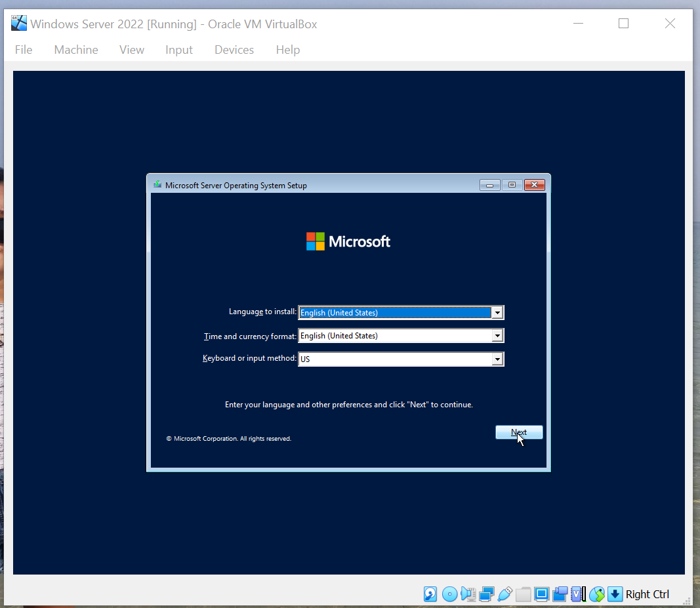

Anastasya Rahma Juniarti / 1202190058 / IT0201
### Ujian Tengah Semester Sistem Administrasi Server 
#### Tutorial Install Windows Server 2022 Pada Virtual Box
## Instalasi Windows Server 2020
- Download Windows Server pada link ini [Windows Server 2022](https://www.microsoft.com/en-us/evalcenter/evaluate-windows-server-2022)
  ```bash
  Download Windows Server. Pilih Download iso
  ```
  

  Isi data diri
  ```bash
  Isi data diri lalu continue
  ```
  

  Pilih bahasa yang akan digunakan
  ```bash
  Pilih bahasa lalu klik download
  ```
  

  ```bash
  Pilih save file. File akan terdownload
  ```
  

  ```bash
  Klik New
  ```
  

  ```bash
  Beri nama pada mesin vm
  ```
  

  ```bash
  Tentukan ukuran memory (RAM)
  ```
  

  ```bash
  Buat virtual harddisk
  ```
  

  ```bash
  Pilih VDI
  ```
  

  ```bash
  Pilih Dinamically Allocated
  ```
  

  ```bash
  Tentukan Ukuran memory harddisk
  ```
  

  ```bash
  Pilih "Windows Server 2022" lalu tekan start
  ```
  

  ```bash
  Pilih disk untuk menginstall sistem operasi. Jika tidak ada, pilih dari file
  ```
  

  ```bash
  Karena masih baru, tekan "Add"
  ```
  

  ```bash
  Cari file iso yang telah terdownload. Lalu pilih
  ```
  

  ```bash
  Pilih file disk
  ```
  

  ```bash
  Klik Start
  ```
  

  ```bash
  Tunggu proses file selesai
  ```
  
  

  ```bash
  Tekan next
  ```
  

  ```bash
  Pilih Install now
  ```
  
  

  Pada opsi ini, saya memilih Datacenter Evaluation Experience (Desktop) karena fitur yang lebih lengkap dan lebih banyak
  ```bash
  Tekan next
  ```
  

  ```bash
  Centang untuk menyetujui license software lalu klik next
  ```
  

  ```bash
  Pilih custom karena sistem operasi ini baru saja diinstall
  ```
  

  ```bash
  Pilih disk space. Lalu next
  ```
  

  ```bash
  Tunggu hingga proses install selesai
  ```
  
  
  

  ```bash
  Sistem akan me-restart otomatis dalam beberapa detik
  ```
  

  ```bash
  Tunggu sistem menampilkan desktop
  ```
  
  

  ```bash
  Buat password login
  ```
  

  ```bash
  Kombinasikan password dengan uppercase, angka, dan faktor mendukung lainnya agar password lebih kuat
  ```
  

  ```bash
  Sistem menampilkan lockscreen
  ```
  

  ```bash
  Untuk mengetik password, masukkan keyboard dengan cara seperti gambar
  ```
  

  ```bash
  Ketikkan password yang telah dibuat
  ```
  
  

  ```bash
  Sistem menampilkan halaman desktop
  ```
  

  ```bash
  Sistem akan menampilkan server manager secara otomatis. Installasi selesai
  ```
  


## Instalasi Active Directory Domain Services, DNS Server, Net Framework 3.5
- Start Windows Server 2022
    ```bash
  Buka Windows PowerShell. Llau ubah nama windows agar lebih mudah menghafalkan namanya
  ```
  

  ```bash
  Restart windows server
  ```
  

  ```bash
  Masuk windows server, ketik server manager lalu pilih
  ```
  

  ```bash
  Pilih add roles and features
  ```
  

  ```bash
  Klik next
  ```
  

  ```bash
  Pilih roled-based lalu klik next
  ```
  

  ```bash
  Klik next
  ```
  

  ```bash
  Pilih Active Directory Domain Services
  ```
  

  ```bash
  Klik add features
  ```
  

  ```bash
  Pilih DNS Server
  ```
  

  ```bash
  Klik add features
  ```
  

  ```bash
  KLik next
  ```
  

  ```bash
  Pilih Net Framework 3.5
  ```
  

  ```bash
  Klik next
  ```
  

  ```bash
  Klik next
  ```
  

  ```bash
  Klik next
  ```
  

  ```bash
  Klik Install
  ```
  

  ```bash
  Tunggu proses file selesai. Lalu close
  ```
  
  
  
## Konfigurasi Promote Server to a Domain Controller
- Buka Server Manager. Pilih Promote this server to a domain controller
  ```bash
  Tekan next
  ```
  

  ```bash
  Pilih New forest lalu isi domain name
  ```
  
  
  ```bash
  Isi Password
  ```
  

  ```bash
  Tekan next
  ```
  

  ```bash
  Tekan next
  ```
  

  ```bash
  Tekan next
  ```
  

  ```bash
  Tekan next
  ```
  

  ```bash
  Tunggu hingga proses selesai
  ```
  
  
  ```bash
  Klik Install
  ```
  
  
  ```bash
  Tunggu hingga proses selesai
  ```
  

  ```bash
  Sistem akan me-restart otomatis dalam beberapa detik
  ```
  

  ```bash
  Tunggu sistem menampilkan lockscreen
  ```
  
  
  ```bash
  Input keyboard lewat virtual box
  ```
  

  ```bash
  Ketikkan password. Pada step ini, nama Windows server sudah terganti
  ```
  

  ```bash
  Buka Network setting
  ```
  

  ```bash
  Pilih Change Adaptor Setting
  ```
  

  ```bash
  Pilih ethernet
  ```
  

  ```bash
  Pilih properties
  ```
  
  
   ```bash
  Pilih IPv4
  ```
  

  ```bash
  Isi Kolom DNS dengan IP
  ```
  

  ```bash
  Sistem akan menampilkan yang awalnya "Network 2" menjadi "sas.local". Maka konfigurasi telah berhasil
  ```
  


Demikian Laporan ini untuk memenuhi syarat penilaian UTS System Adminstrasi Server

  
  
  
  
  
  
  
