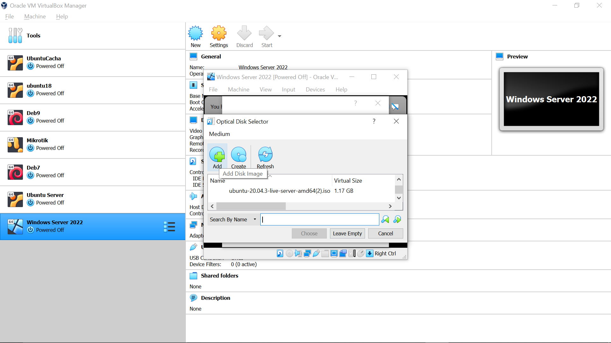
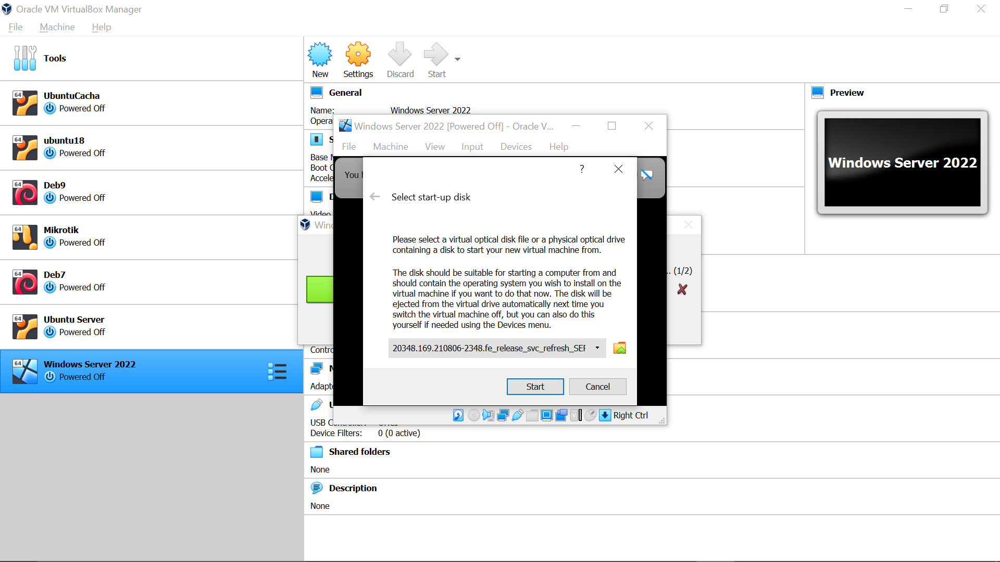

Anastasya Rahma Juniarti / 1202190058 / IT0201
### Ujian Tengah Semester Sistem Administrasi Server 
#### Tutorial Install Windows Server 2022 Pada Virtual Box
## Instalasi
- Download Windows Server pada link ini [Windows Server 2022](https://www.microsoft.com/en-us/evalcenter/evaluate-windows-server-2022)
  ```bash
  Download Windows Server. Pilih Download iso
  ```
  

  Isi data diri
  ```bash
  Isi data diri lalu continue
  ```
  

  Pilih bahasa yang akan digunakan
  ```bash
  Pilih bahasa lalu klik download
  ```
  

  ```bash
  Pilih save file. File akan terdownload
  ```
  

  ```bash
  Klik New
  ```
  

  ```bash
  Beri nama pada mesin vm
  ```
  

  ```bash
  Tentukan ukuran memory (RAM)
  ```
  

  ```bash
  Buat virtual harddisk
  ```
  

  ```bash
  Pilih Dynamically Allocated
  ```
  

  ```bash
  Pilih VDI
  ```
  

  ```bash
  Pilih Dinamically Allocated
  ```
  

  ```bash
  Tentukan Ukuran memory harddisk
  ```
  

  ```bash
  Pilih "Windows Server 2022" lalu tekan start
  ```
  

  ```bash
  Pilih disk untuk menginstall sistem operasi. Jika tidak ada, pilih dari file
  ```
  

  ```bash
  Karena masih baru, tekan "Add"
  ```
  

  ```bash
  Cari file .iso yang telah terdownload. Lalu pilih
  ```
  

  ```bash
  Pilih file disk
  ```
  

  ```bash
  Klik Start
  ```
  

  ```bash
  Tunggu proses file selesai
  ```
  
  

  ```bash
  Tekan next
  ```
  

  ```bash
  Pilih Install now
  ```
  
  

  Pada opsi ini, saya memilih Datacenter Evaluation Experience (Desktop) karena fitur yang lebih lengkap dan lebih banyak
  ```bash
  Tekan next
  ```
  

  ```bash
  Centang untuk menyetujui license software lalu klik next
  ```
  

  ```bash
  Pilih custom karena sistem operasi ini baru saja diinstall
  ```
  

  ```bash
  Pilih disk space. Lalu next
  ```
  

  ```bash
  Tunggu hingga proses install selesai
  ```
  
  
  

  ```bash
  Sistem akan me-restart otomatis dalam beberapa detik
  ```
  

  ```bash
  Tunggu sistem menampilkan desktop
  ```
  
  

  ```bash
  Buat password login
  ```
  

  ```bash
  Kombinasikan password dengan uppercase, angka, dan faktor mendukung lainnya agar password lebih kuat
  ```
  

  ```bash
  Sistem menampilkan lockscreen
  ```
  

  ```bash
  Untuk mengetik password, masukkan keyboard dengan cara seperti gambar
  ```
  

  ```bash
  Ketikkan password yang telah dibuat
  ```
  
  

  ```bash
  Sistem menampilkan halaman desktop
  ```
  

  ```bash
  Sistem akan menampilkan server manager secara otomatis. Installasi selesai
  ```
  


  
